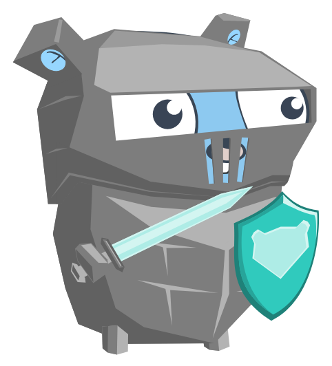

# Part 2: Create a Custom HTTP Client


<!-- 

 -->

> **One-liner:** *Even more* easily **create** and **share** secrets with colleagues using this small CLI client.

<figure>
    
    <figcaption>Our Knight Gopher standing ready to defend against any attempts at brute force attacks!.</figcaption>
</figure>

## Quick Start

> Note: before running the CLI client you need to have the API from Part 1 running. Head over to Part 1 for installation instructions.

```bash
# Clone repo to local machine
git clone https://github.com/travboz/secrets-sharing-api.git

# cd into repository root directory (e.g. milestone 2)
cd secrets-sharing-api/part2/milestone2-code

# Download dependencies
go mod download

# Run
make build
# This builds into `bin/` and the output CLI becomes:
# bin/cli

# Use the help command for available subcommands.
./bin/cli --help # or -h
```

That's it! You're ready to use it.

## Roadmap & Why This Project?

I purchased this project course because I was under the impression *we'd* build something cool - turns out **I** was the one doing the building. This project helped build confidence in **testing** and **problem solving** (specifically, working through the steps required to solve a problem).

What part taught the project really taught me:
<blockquote><p>Tests don't have to be scary.</p><p>CLI tools don't have to be scary.</p></blockquote>

See the [project](https://www.manning.com/liveproject/build-a-secrets-sharing-web-application) brief on Manning for more information.

- [x] **Milestone 1, Create the Custom HTTP Client:** write a command-line HTTP client for the secret sharing web application. This client will implement a user-friendly interface for creating and viewing secrets via the command line.
- [x] **Milestone 2, Testing the HTTP Client:** write tests for the client application created in Milestone 1.

## Note: My learning experience

> I spent a little bit too much time planning the layout of this CLI. I deviated from the original brief by implementing two subcommands (`view` and `create`) instead of shotgunning all the flags into one long string of arguments. This mimics (at least on a small scale) those CLIs we always used - like `git`. See the thought process and planning in its section below.
> I then spent too much time focusing on the `secret.go` tests and was uncertain if they were required. I had completed the `parse_args.go` and `validation.go` tests already and wasn't sure why `secret.go` was taking so long - so I downloaded the solution and checked if they were included. These ended up not being included and I figured the rationale was because we controlled the API and were assuming, to a heavy degree, that everything would follow the 'happy path' generally. So, I've kept that work there for reference because it helped solidify Go's `http.Handler` interface.

## Installation

### Prerequisites

- Golang `1.26.4+`
- git

### Picking a milestone

This project consisted of the `2` milestones - which were created in sequence.

To jump into a particular milestone just pick one, navigate to its directory, and explore.

For example:

```bash
# Clone repo
git clone https://github.com/travboz/secrets-sharing-api.git

# Navigate to the final milestone's directory
cd secrets-sharing-api/part2/milestone2-code

# Download and install dependencies
go mod download
```

### Option 1: Build from source

```bash
# Build the application
go build -o bin/cli .

# Run the CLI help command for usage
./bin/cli --help
```

### Option 2: Build using `Taskfiles`

```bash
# Download and install dependencies
go mod download

# To view available tasks
task -l

# Build the binary and run it
task build

# Run the CLI help command for usage
./bin/cli --help
```

## Usage

### Directory structure

To illustrate, here is the tree from the `milestone2-code` directory + those in the `part2` of the repository.

The other milestone directory follows a similar structure.

```bash
part2/
├── README.md # Info and description on the repo.
├── milestone1-code # All milestone 1 related code (omitted for brevity).
└── milestone2-code # All milestone 2 related code.
    ├── Makefile
    ├── README.md
    ├── bin # Omitted from repo but this is where the 'build' task places the binary.
    │   └── cli
    ├── config.go # Configuration information for custom client.
    ├── errors.go # Sentinel error values for fail conditions on function.
    ├── go.mod # Go package dependency file.
    ├── main.go # Entrypoint of the API.
    ├── parse_args.go # Argument parsing logic.
    ├── parse_args_test.go
    ├── perform_action.go # Performs the actual call to the Secret Sharing API - once arguments have been parsed and validated.
    ├── perform_action_test.go
    ├── secret.go # Helper functions for perform action.
    ├── secret_test.go
    ├── utils.go # Usage, description and constants used through the CLI.
    ├── validation.go # Validates the config returned after parsing the CLI arguments.
    └── validation_test.go
```

### Basic Example

```bash
./bin/cli create --url http://localhost:8080/ --data "super-secret" 
# output: envirtnbj45ngn4ik5tg9jien
# Returns an id if the secret was created successfully.
```

## CLI Reference

| Endpoint | HTTP method | Payload expected |
| -- | -- | -- |
| `/` | `POST` | Yes |
| `/{id}` | `GET` | No |
| `/healthcheck` | `GET` | No |

## CLI Usage

**1.** The following send a create secret request and receive a response containing a `SHA256` hash of the secret.

```bash
PAYLOAD='{"plain_text":"super-secret"}'
URL='http://localhost:8080'

curl -d "$PAYLOAD" "$URL"/
# output: {"id": "vnerbnvebnernvewcinij34323wq"}
```

**2.** Then use that generated hash to retrieve the secret.

```bash
ID='vnerbnvebnernvewcinij34323wq'
URL='http://localhost:8080'

curl -X GET "$URL"/"$ID"
# output: {"secret": "super-secret"}
```

## Learning: CLI planning

CLI for the HTTP client for the secret sharing web application will be:

```bash
secret-share <verb> [flags]
```

We only have 2 possible commands (actions):

1. `view` --url=url-of-server --id=id
2. `create` --url=url-of-server --data=some-secret-text

So, some examples:

```bash
# Create a new secret
secret-share create --url=localhost:8080/ --data="super-secret-colour"
# output: id=<some-id>

# View a created secret
secret-share view --url=localhost:8080/ --id=secret-colour-hashed-id
# output: data=<super-secret-colour>
```

### Structure of CLI: CLI Command Structure Reference

#### Noun-First (`tool <noun> <verb> [flags]`)

Group by resource. All actions on a resource live together.

```bash
git remote add
git remote remove
git remote list

docker container run
docker container start
docker compose up

aws s3 cp
aws s3 ls
aws s3 rm
```

**Good for:** tools with a fixed set of resources and many operations per resource.

---

#### Verb-First (`tool <verb> <noun> [flags]`)

Group by action. One verb applies across many resource types.

```bash
kubectl get pods
kubectl get services
kubectl delete pods
kubectl describe nodes

systemctl start nginx
systemctl stop nginx
systemctl status nginx
```

**Good for:** tools with a small, stable set of actions applied broadly.

---

#### Flags = Adjectives

- Modify the noun/verb without changing the sentence shape.
- Keep meaning consistent across all subcommands.

```bash
kubectl get pods --namespace=prod --output=json
git branch list --merged --sort=-committerdate
```

## Troubleshooting

> todo
<!-- 
### Error: "Cannot find module"

```bash
# Clear node_modules and reinstall
rm -rf node_modules package-lock.json
npm install
```

### Error: "Port already in use"

```bash
# Find and kill process on port
lsof -i :3000
kill -9 [PID]
```

### Still stuck?

- Check [existing issues](link)
- Join our [Discord](link)
- Open a [new issue](link) -->

## License

MIT © [Travis](https://github.com/travboz)

## Acknowledgments

- [Manning](https://www.manning.com/) - Producer of liveProject
- [Gopher](https://github.com/egonelbre/gophers) illustration by Egon Elbre (egonelbre/gophers), [CC0 1.0](https://creativecommons.org/publicdomain/zero/1.0/)
